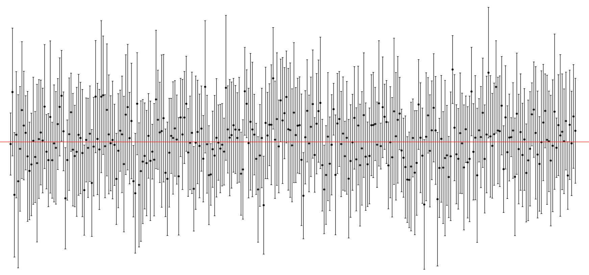
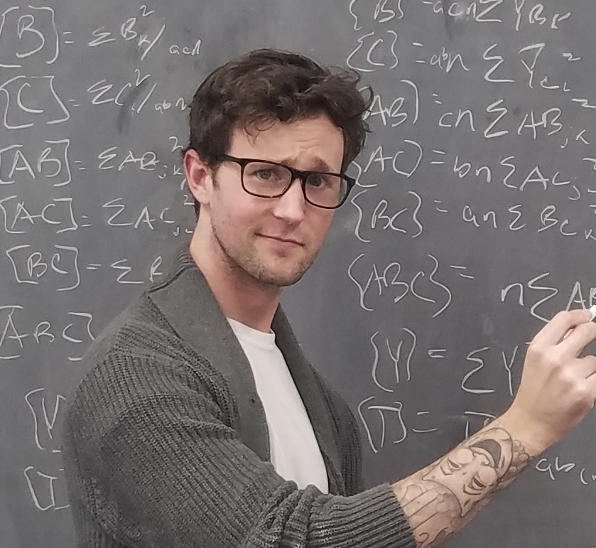

```{r setup, include=FALSE}
knitr::opts_chunk$set(echo = FALSE)

# Learn more about creating websites with Distill at:
# https://rstudio.github.io/distill/website.html

# Learn more about publishing to GitHub Pages at:
# https://rstudio.github.io/distill/publish_website.html#github-pages

```

# Brief Background

<font size="4"> **Education**</font> $-$

Before coming to Stony Brook, I earned my B.A. in Psychology at Winona State University in Minnesota and was a summer research intern in the Cognition and Development Lab at Yale University. At Stony Brook, I've earned an M.A. in Psychology and the Advanced Certificate in Quantitative Methods, en route to the Ph.D. I should complete the program in 2024. For more details on my academic training and background, see my full ACADEMIC CV or my RESUME.

<font size="4"> **Skills**</font> $-$

*General*: Experimental design, project management, public speaking, scientific/technical writing, supervision/mentoring, teaching. 

*Languages*: Proficient with R and the fundamentals of Git/Github. Some experience with Python, LaTeX, SAS, HTML/CSS, and JavaScript.

*Statistics/Modeling*: Correlation, linear regression/ANOVA (OLS), generalized linear models (GLMs), mixed effect OLS and GLMs, meta-analysis, multivariate methods (e.g., EFA/CFA), some Bayesian methods. 

<font size="4"> **Hobbies**</font> $-$

When not doing or thinking about research, I'm probably watching a movie/series, reading non-fiction, or deciding what food to order.

```{r,include=FALSE}
library(tidyverse)
```

```{r, layout="l-screen-inset", eval=FALSE}
# simulate data and make banner plot
#set.seed(333)
#tibble(agent = seq(1:300),
#       rating_mean = rnorm(n = 300, mean = 0, sd = 0.25),
#       rating_sd = rnorm(n = 300, mean = 0.5, sd = 0.10)) %>%
#  ggplot(aes(x = agent, y = rating_mean)) +
#  geom_point() +
#  geom_errorbar(aes(ymin = rating_mean - rating_sd,
#                    ymax = rating_mean + rating_sd)) +
#  geom_hline(yintercept = 0, color = "red") +
#  theme_void()

#
```

# Research Interests

I'm interested in a number of topics, namely $-$

- **Social & Collective Memory**
  - How does collaboration in face-to-face and online environments influence *memory performance*?
  - How does working in a group, or being a member of a group, influence the emergence of *collective memory*?
  - How does remembering information in a social context (e.g., in a group) influence the *subsequent learning of new information*?
  - How do different social network features (structure/dynamics) influence the development and maintenance of collective memory?
  
- **Quantifying Collective Memory**
  - What does it mean for an event/story/etc. to be collectively remembered?
  - Can we use metrics from research on individual memory (e.g., clustering, temporal contiguity) to quantify the *"structure" of collective memory*?
  - How does collective memory *change across time*?
  
- **Collective Memory** $\leftarrow$ ? $\rightarrow$ **Collective Belief/Decisions/Behavior**
  - How does collective memory influence other collective phenomena, such as *collective beliefs and decisions*?
  - What role does collective memory play in the *accumulation of culture*?
  

```{r, layout="l-screen-inset",eval=FALSE}
#cowplot::ggdraw() + 
#  cowplot::draw_image(here::here("images", "chalkboard.jpg"), width = 0.5) + 
#  cowplot::draw_image(here::here("images", "lily.jpg"), width = 0.5, x = 0.51)
```

```{r, eval=FALSE}
#<aside>
#  <h3>Me doing ANOVAs (by hand?!) in 2019</h3>
#  
#</aside>
```

# Updates

Site last updated on `r format(Sys.time(), '%d %B, %Y')`